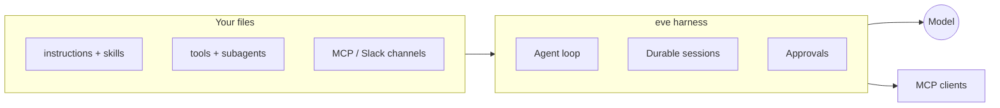

# eve-agent-learning

**Build a production-grade AI agent with [eve](https://eve.dev) — not a toy chatbot.** This repo is a complete, runnable **Pears Support** agent: real tools, human-in-the-loop refunds, subagents, durable workflows, MCP for Cursor, evals, guardrails, and memory. Fork it, star it, learn from it, deploy it.

[](LICENSE)
[](https://nodejs.org/)
[](https://eve.dev)
[](https://github.com/santanu-labs/eve-agent-learning/actions/workflows/ci.yml)

> If this saves you time, **[give the repo a star](https://github.com/santanu-labs/eve-agent-learning)** — it helps others find it and keeps the project maintained.

---

## Why this repo exists

Most agent tutorials stop at “call the model in a loop.” This project shows **the harness**: how to design tools the model actually uses, gate dangerous actions, run work in the background, test behavior with evals, and expose the agent as an **MCP service** to Claude Code and Cursor.

| You get | Why it matters |
|--------|----------------|
| **19-chapter course + full source** | Type-along path from “Hello, agent” to red-team CI — see [`docs/SHARING.md`](docs/SHARING.md) |
| **Runnable reference agent** | Every pattern is wired and working in `agent/` |
| **MCP “order-agent”** | Drive the agent from Cursor with durable `agent_start` / `agent_get` |
| **Deterministic evals** | `npm run eval` — prove lookups and refund policy, not vibes |
| **Production patterns** | Approvals, audit logs, tool budgets, memory, schedules, subagents |

**Who it’s for:** TypeScript developers learning **Vercel eve**, MCP, and agent safety — whether you’re prototyping support automation or studying how to structure real agent systems.

---

## Quick start (under 2 minutes)

```bash
git clone https://github.com/santanu-labs/eve-agent-learning.git
cd eve-agent-learning
npm install
cp .env.example .env.local
# Set OPENAI_API_KEY, OPENAI_BASE_URL, OPENAI_MODEL (any OpenAI-compatible endpoint)
npm run dev
```

Talk to the agent in the terminal, or connect MCP (with dev server running):

```json
{
  "mcpServers": {
    "order-agent": {
      "url": "http://localhost:2000/mcp"
    }
  }
}
```

Copy from [`.cursor/mcp.json.example`](.cursor/mcp.json.example). Example tasks: *“What has priya@example.com ordered?”* · *“Audit refund for ORD-1003”* · *“Classify tickets in data/tickets.json”*

---

## What’s inside



- **Orders** — `search_orders`, `get_order`, optional Petstore OpenAPI connection  
- **Refunds** — `audit_refund`, human-approved `issue_refund`, `refund_auditor` subagent  
- **Support** — `ticket_classifier` + `reviewer` for batch triage  
- **Workflows** — `watch_order` (durable polling), workflow orchestration  
- **Ops** — audit hook, daily sales schedule, sandbox CSV reports  
- **Safety** — redaction in logs, per-turn tool budget, policy skills  

Sample data only (`ORD-*` orders, demo tickets) — safe to share and fork.

---

## Learn the full course

The **complete hands-on curriculum** (goals, diagrams, pitfalls, experiments, Loop-book cross-links) lives in one place:

**→ [docs/SHARING.md — Building Production Agents with eve](docs/SHARING.md)** (19 chapters + appendices)

The repo root is the **running implementation**; the doc is the **textbook**. Start here for setup and overview; dive into the doc when you’re building chapter by chapter.

More docs: [`docs/README.md`](docs/README.md)

---

## Scripts

| Command | Description |
|---------|-------------|
| `npm run dev` | Dev server + interactive TUI |
| `npm run build` | Production build |
| `npm run deploy` | Deploy with `eve deploy` (Vercel) |
| `npm run eval` | Run agent evals against a live target |
| `npm run typecheck` | TypeScript check |

---

## Project layout

| Path | Purpose |
|------|---------|
| `agent/` | Instructions, tools, skills, subagents, channels, hooks |
| `lib/` | Orders, refunds, budget, memory, redaction |
| `data/` | Sample tickets and jobs |
| `evals/` | Deterministic tests (`lookup`, refund escalation) |
| `docs/` | Full course — links back to this README |

---

## Deploy

```bash
eve deploy
```

Configure env vars from [`.env.example`](.env.example). See [eve deployment on Vercel](https://eve.dev/docs/guides/deployment/vercel).

---

## Share and grow reach

- **Star** the repo: [github.com/santanu-labs/eve-agent-learning](https://github.com/santanu-labs/eve-agent-learning)  
- **Fork** and adapt for your domain (keep the harness patterns)  
- **Open issues** with questions — good questions become docs  
- **Suggested GitHub topics:** `eve`, `ai-agents`, `mcp`, `vercel`, `typescript`, `agent-framework`, `llm-tools`  

If you write about this project, link to the repo and mention **eve-agent-learning** + **MCP order-agent** — helps others discover the same patterns.

---

## Security

Demo agent, not production commerce. See [SECURITY.md](SECURITY.md). Never commit `.env.local`.

---

## License

MIT — [LICENSE](LICENSE).

---

## Links

- [eve documentation](https://eve.dev/docs) · [Build an Agent tutorial](https://eve.dev/docs/tutorial/first-agent) · [eve on GitHub](https://github.com/vercel/eve)  
- **This repo:** [santanu-labs/eve-agent-learning](https://github.com/santanu-labs/eve-agent-learning)
